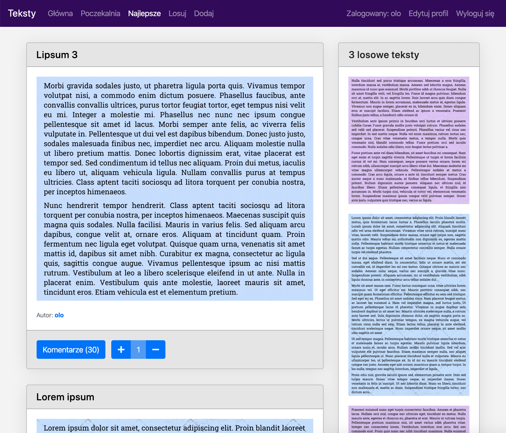

# texts
Unfinished Django project that I have started a while ago when I was learning Django. It is a website similar to 9gag but for pasting texts that are converted to images with imgkit and Celery libraries. The GUI is based on Bootstrap.

How to run in development environment:
1. Install Docker along with docker-compose.
1. Copy sample config file ``.env.example`` to ``.env`` and set ``DEBUG`` to ``1``.
1. Use ``docker-compose build`` to create container images.
1. Use ``docker-compose up`` to start the container.
1. Run ``./setup.sh`` to collect static files, setup the database and create superuser.
1. Then go to ``http://127.0.0.1:8000`` and access the website.

How to run in production environment:
1. Install Docker along with docker-compose.
1. Copy sample config file ``.env.example`` to ``.env`` and change all the credentials.
1. Use ``docker-compose -f docker-compose.prod.yml build`` to create container images.
1. Use ``docker-compose -f docker-compose.prod.yml up`` to start the container.
1. Run ``./setup.prod.sh`` to collect static files, setup the database and create superuser.
1. Then go to ``http://127.0.0.1:8000`` and access the website.

TODO:
1. REST API with Django REST framework
1. Comments
1. Comments pagination
